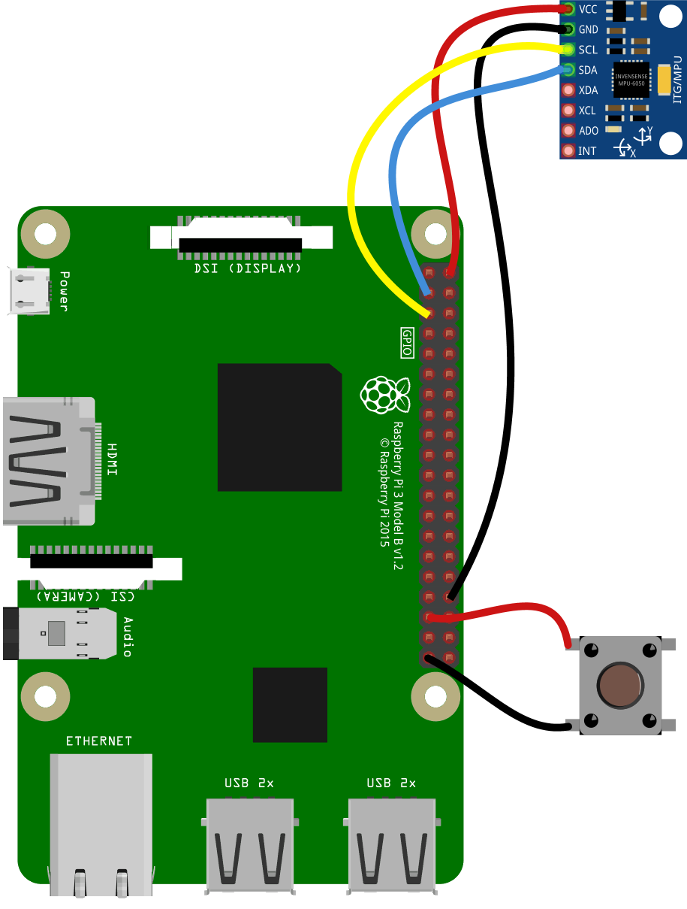
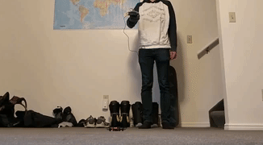

# Codrone-Motion-Control
Using an MPU6050 gyroscope connected to a Raspberry assembled on a glove to control a Codrone quadrocopter

The schematic for the electronics with the MPU6050.  
SCL (Serial Clock) is used for the clock pulse in the I2C connection.  
SDA is for the data connection.  

An early protoype with the MPU6050 taped to the top of the back of the hand, with the bluetooth board wrapped around and dangling off the Raspberry Pi.

The final product showing various improvements, not least of which is an actual glove, easy acces to the takeoff/land button on the side, and a more compact design with the bluetooth board on top of the Raspberry Pi.

The drone in action. The throttle is limited to protect the drone from collisions.
